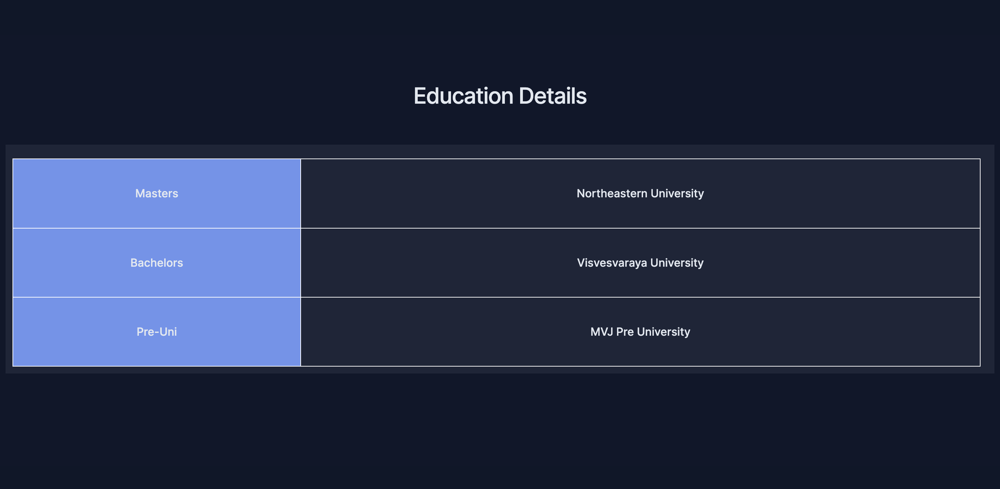
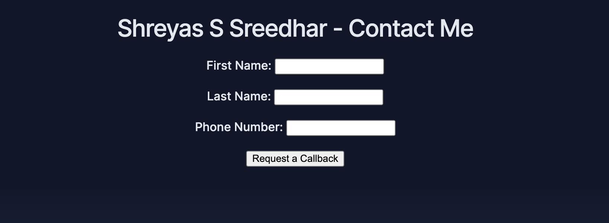
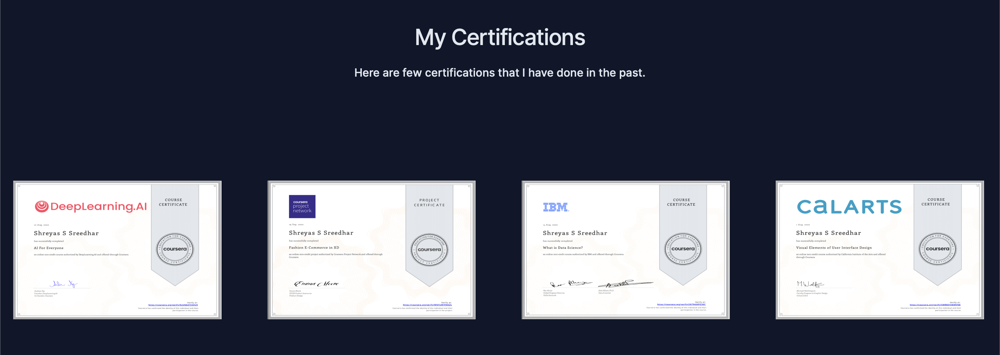
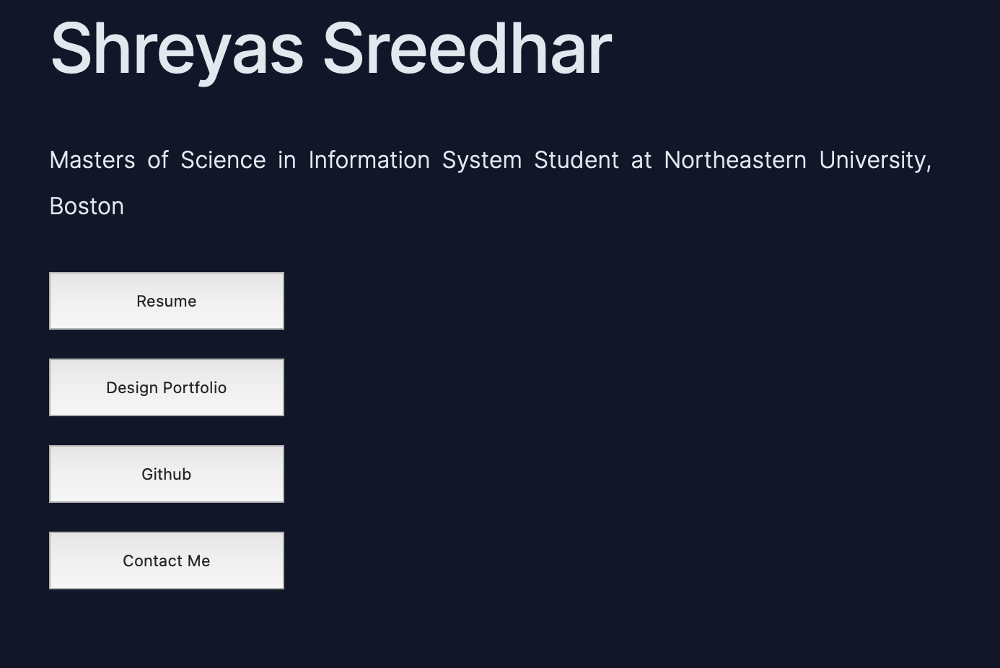
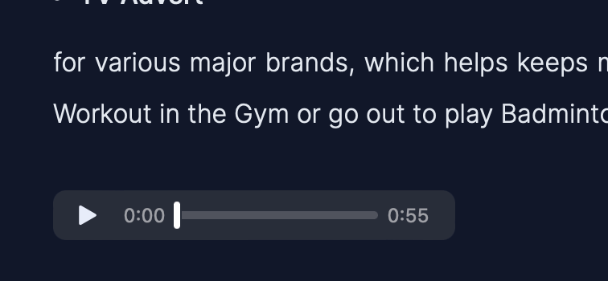
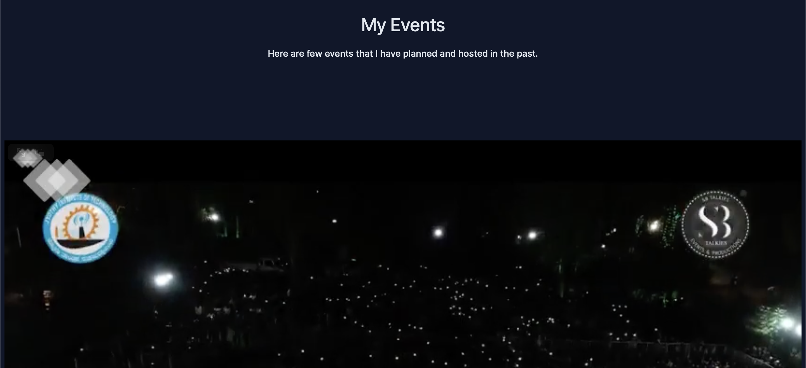
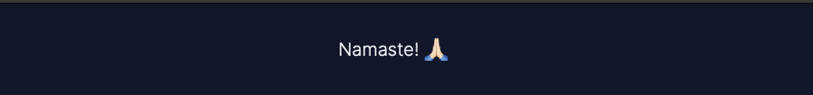
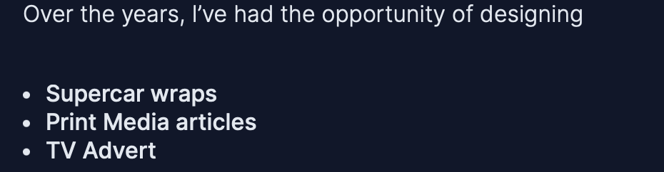

# INFO6150-Assignment2
## Assignment-2 of INFO610 by Shreyas (sreedhar.sh@northeastern.edu)
### Portfolio  Website
This is a simple portfolio website that utilises HTML and CSS made to let the users know about the car and few of its features. Click on the Tags for a dropdown with details on where the Tags are being used. 

 
 Media Queries 
 

  
    
   A abstract view of the media Queries that are being used to make the site responsive, [style.css](./styles.css) contains more info on it.

 
 Favicon 
 

  
    
   Downloaded the Tesla Logo Favicon from a website, used the same Logo to match the theme. 

 
 Table 
 
  
  
    
   Utilised the Table tag to talk about the Specs and Features of the Car. Used border-collapse: collapse; to allow adjacent tabs to share borders. 

 
 Form 
 
  
  
   
  In the [contact-me.html](./contact-me.html) Page, Used form to collect the Data from the User.

 
 Images & Image Gallery with Hover effect 
 
  
  
    
  Utilised the certtifcation section to show my certifications in an image gallery

 
 HyperLink 
 
  
  
   
  Utilised multple Hyperlinks throughout the side, this example allows the user to go to resume or design portfolo etc.

 
 Button 
 
  
  
   
  Added buttons and gave a specific height and width to it, so all other buttons on the site remains consistent. Added button:hover to the element, so once the user hovers, the color changes from off-white(Azure)

 
 Audio 
 
  
  
   
  Text-to-speech audio for accessibility  

 
 Video 
 
  
  
    
  Used this video to the last biggest event i organised.

 
 Header 
 
  
  
    Header element includes a simple Namaste

 
 Footer 
 
  
  
   
  Added a gradient to footer and my basic details to it. 

 
 Summary 
 
  
  
   
  Used the summary tag to hide the prices of the car utill the user clicks on it to reveal the pricing. 

 
 Menu 
 
  
  
  Used the Menu tag to list out the Available models in the Enquire Page. Added the Horizonatal menu(Navbar) in the home page as well.

 
 Tel for Contact Info 
 
  
  
   
  Used my number in the button that enalbles the user to call incase they want more details. 

 
 Mailto for Contact Info 
 
  
  
    Used my email ID in a button that enables the user to email incase they want more details 

